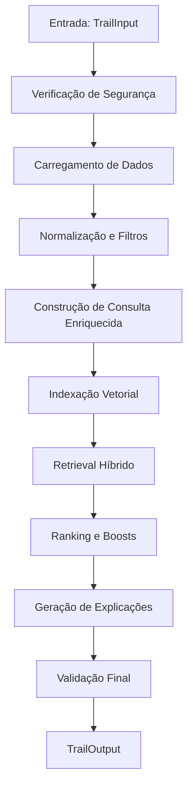

# Sistema de Recomendação de Trilhas Educacionais - Leve Agents

## Visão Geral

O Sistema de Recomendação de Trilhas Educacionais é um motor híbrido inteligente que combina busca semântica (MPNet) e busca textual (BM25) para recomendar trilhas educacionais personalizadas para jovens brasileiros. O sistema utiliza perfis psicológicos detalhados e contexto do usuário para gerar recomendações precisas, explicáveis e altamente relevantes.

### Características Principais

- **Sistema Híbrido**: Combina busca semântica (75%) com busca textual (25%)
- **Personalização Avançada**: Utiliza perfil psicológico completo do usuário
- **Explicabilidade**: Gera explicações claras para cada recomendação
- **Escalabilidade**: Suporte a índices persistentes com PostgreSQL + pgvector
- **Observabilidade**: Logging completo e métricas detalhadas

## Arquitetura do Sistema

### Fluxo Principal de Processamento



### Componentes Principais

1. **Verificação de Segurança** - Filtros para consultas inadequadas
2. **Carregamento de Dados** - Snapshot do usuário + catálogo de trilhas via API
3. **Normalização** - Conversão para TrailCandidate com deduplicação
4. **Construção de Consulta** - Pergunta + pistas do perfil + contexto adicional
5. **Indexação** - Índices vetoriais (MPNet) e BM25 persistentes
6. **Retrieval** - Busca híbrida combinando semântica e textual
7. **Ranking** - Aplicação de regras de negócio e boosts personalizados
8. **Output** - Geração de explicações e validação final

## Estrutura Detalhada do Sistema

### 📁 `reco/` - Módulo Principal de Recomendação

#### **`config.py`** - Configuração Central do Sistema
**Responsabilidade**: Centraliza todas as configurações do sistema de recomendação

**Funcionalidades Principais**:
- **Regras de Negócio**: Thresholds, boosts, limites operacionais
- **Sistema de Embeddings**: Configurações do modelo MPNet multilíngue
- **Sistema Híbrido**: Pesos e métodos de normalização
- **Integração API**: Timeouts, retries e configurações HTTP
- **Banco de Dados**: PostgreSQL + pgvector para índices persistentes

**Configurações Críticas**:
```python
# Thresholds por tipo de conteúdo
MATCH_THRESHOLD_TRILHAS: float = 0.80  # Trilhas educacionais
MATCH_THRESHOLD_VAGAS: float = 0.85    # Vagas (futuro P2)

# Pesos do sistema híbrido
WEIGHTS: {"semantic": 0.75, "bm25": 0.25}  # Prioriza busca semântica

# Boosts de negócio
TITLE_DESC_BOOST: float = 0.12      # Palavras-chave no título/descrição
TAG_BOOST: float = 0.08             # Tags que aparecem na consulta
BEGINNER_BOOST: float = 0.05        # Trilhas nível iniciante
EDUCATIONAL_RELEVANCE_BOOST: float = 0.10  # Relevância educacional
```

#### **`pipeline.py`** - Orquestrador Principal
**Responsabilidade**: Executa o pipeline completo de recomendação

**Fluxo Detalhado**:
1. **Verificação de Segurança**: Filtra consultas inadequadas
2. **Carregamento**: Snapshot do usuário + catálogo via API
3. **Normalização**: Conversão para TrailCandidate com deduplicação
4. **Construção de Consulta**: Enriquecimento com pistas do perfil
5. **Indexação**: Criação de índices vetoriais persistentes
6. **Retrieval Híbrido**: Combinação BM25 + MPNet
7. **Ranking**: Aplicação de boosts e regras de negócio
8. **Explicações**: Geração de why_match para cada recomendação
9. **Validação**: Aplicação de regras de negócio finais

#### **`normalizer.py`** - Sistema de Normalização de Dados
**Responsabilidade**: Normalização e limpeza de dados do catálogo

**Funcionalidades**:
- **Conversão**: Dados brutos → TrailCandidate (schema padronizado)
- **Deduplicação**: Remove duplicatas por publicId mantendo maior completude
- **Filtros**: Aplica filtros por status (Published)
- **Higienização**: Limpa espaços e normaliza campos
- **Completude**: Sistema de scoring para manter melhor qualidade

**Funções Principais**:
```python
to_candidates(raw_items)           # Conversão com validação
dedupe_by_public_id(candidates)   # Deduplicação inteligente
filter_by_status(candidates)      # Filtro por status
fill_missing_combined_text()      # Preenchimento de texto combinado
```

#### **`query_builder.py`** - Sistema de Construção de Consultas
**Responsabilidade**: Construção inteligente de consultas enriquecidas

**Estratégia de Enriquecimento**:
1. **Base**: Pergunta do usuário com contexto educacional
2. **Pistas do Perfil**: Até 3 pistas relevantes do snapshot psicológico
3. **Contexto Extra**: Informações adicionais fornecidas pelo usuário
4. **Sinônimos**: Expansão opcional (apenas BM25)

**Priorização de Pistas do Perfil**:
1. Objetivos de carreira (principal, específicos, curto prazo)
2. Dificuldades e barreiras de aprendizado
3. Preferências de aprendizado (modalidade, ritmo, horário)
4. Interesses pessoais e direção profissional
5. Perfil DISC e talentos CliftonStrengths
6. Aspirações profissionais

#### **`ranker.py`** - Sistema Inteligente de Ranking
**Responsabilidade**: Aplicação de regras de negócio e ordenação de resultados

**Sistema de Boosts**:
- **TITLE_DESC_BOOST** (0.12): Palavras-chave no título/descrição/conteúdo
- **TAG_BOOST** (0.08): Tags que aparecem na consulta
- **BEGINNER_BOOST** (0.05): Trilhas nível iniciante (ajuda descoberta)
- **EDUCATIONAL_RELEVANCE_BOOST** (0.10): Relevância educacional

**Processo de Ranking**:
1. Aplicação de boosts baseados em conteúdo
2. Filtro por threshold específico por tipo de conteúdo
3. Deduplicação por publicId (mantém maior score)
4. Ordenação por score final
5. Fallback de dominância para garantir resultados

### 📁 `reco/embeddings/` - Sistema de Embeddings

#### **`embedding_provider.py`** - Provedor de Embeddings
**Responsabilidade**: Gerenciamento do modelo MPNet multilíngue

**Funcionalidades**:
- **Carregamento Lazy**: Modelo carregado sob demanda
- **Processamento em Batch**: Embeddings gerados em lotes
- **Normalização L2**: Para similaridade por cosseno
- **Suporte CPU/GPU**: Detecção automática de dispositivo

**Modelo**: `paraphrase-multilingual-mpnet-base-v2` (768 dimensões)

### 📁 `reco/index/` - Índices Vetoriais

#### **`vector_index.py`** - Índice Vetorial
**Responsabilidade**: Armazenamento e busca por similaridade vetorial

**Backends Suportados**:
- **NumPy**: Padrão para catálogos pequenos/médios
- **FAISS**: Opcional para grandes volumes
- **PostgreSQL + pgvector**: Persistente para produção

**Operações**:
- `upsert()`: Insere/atualiza vetores
- `search()`: Busca Top-K por similaridade
- `delete()`: Remove itens
- **Filtros**: Suporte a filtros por metadados

#### **`persistent_indexer.py`** - Indexador Persistente
**Responsabilidade**: Gerenciamento de índices persistentes com PostgreSQL

### 📁 `reco/retriever/` - Sistema de Retrieval

#### **`dense_retriever.py`** - Retrieval Denso (MPNet)
**Responsabilidade**: Busca semântica usando embeddings

**Processo**:
1. Gera embedding da consulta enriquecida
2. Busca no índice vetorial por similaridade
3. Retorna Top-K com scores semânticos
4. Aplica filtros por metadados

#### **`hybrid_retriever.py`** - Retrieval Híbrido
**Responsabilidade**: Combina BM25 + MPNet com normalização inteligente

**Processo**:
1. Busca em ambos os caminhos (BM25 + Denso)
2. Deduplica resultados por ID
3. Normaliza scores (robust normalization)
4. Aplica blending com pesos configuráveis
5. Retorna Top-K com score combinado

**Pesos Padrão**: 75% semântico + 25% BM25

### 📁 `reco/` - Módulos Auxiliares

#### **`indexer.py`** - Indexador BM25
**Responsabilidade**: Busca textual usando BM25/TF-IDF

**Funcionalidades**:
- **BM25**: Algoritmo de ranking textual (preferencial)
- **TF-IDF**: Fallback se BM25 não disponível
- **Expansão de Sinônimos**: Apenas no caminho BM25
- **Tokenização**: Acento-insensível e case-insensível

#### **`explainer.py`** - Geração de Explicações
**Responsabilidade**: Cria explicações claras para recomendações

**Estratégia**:
- **Tom jovem e cordial**: Linguagem adequada ao público
- **Identificação de Âncoras**: Tags, palavras-chave, nível
- **Matching Acento-insensível**: Busca robusta
- **Cues de Formato**: "aulas curtas", "tem vídeos", etc.
- **Confiança**: Reforço quando score alto

#### **`output_builder.py`** - Construção de Saída
**Responsabilidade**: Monta resposta final (TrailOutput)

**Funcionalidades**:
- **Status**: "ok" (com sugestões) ou "fora_do_escopo"
- **Pluralização**: Ajusta texto conforme quantidade
- **Query Understanding**: Extrai tema e palavras-chave
- **Higienização**: Garante textos seguros

#### **`safety_filters.py`** - Filtros de Segurança
**Responsabilidade**: Verificação de consultas inadequadas

#### **`recommendation_logger.py`** - Sistema de Logging
**Responsabilidade**: Registra sessões para observabilidade

**Funcionalidades**:
- **Logs Estruturados**: JSONL com metadados completos
- **Métricas**: Tempo de execução, sucesso, scores
- **Exportação**: CSV para análise
- **Rastreabilidade**: Session ID único

## Schemas de Dados

### 📁 `schemas/` - Definições de Dados

#### **`trail_input.py`** - Schema de Entrada
```python
class TrailInput(BaseModel):
    user_question: str          # Pergunta do usuário (8-500 chars)
    user_id: Optional[UUID]     # ID para personalização
    contexto_extra: Optional[str]  # Contexto adicional
    max_results: int = 3        # Máximo de sugestões (1-3)
```

#### **`trail_candidate.py`** - Schema de Candidato
```python
class TrailCandidate(BaseModel):
    publicId: UUID              # ID único obrigatório
    title: str                  # Título da trilha
    subtitle: Optional[str]     # Subtítulo
    tags: List[str]             # Tags/temas
    topics: List[str]           # Tópicos
    difficulty: Optional[Difficulty]  # Nível
    description: str            # Descrição
    status: Optional[Status]    # Status (Published/Draft)
    combined_text: str          # Texto para embeddings
```

#### **`trail_output.py`** - Schema de Saída
```python
class TrailOutput(BaseModel):
    status: Literal["ok", "fora_do_escopo"]
    short_answer: str           # Resposta resumida
    suggested_trails: List[SuggestedTrail]  # Sugestões
    query_understanding: QueryUnderstanding  # Análise da consulta
```

## Configurações Operacionais

### Thresholds por Tipo de Conteúdo
- **Trilhas Educacionais**: 0.80 (mais rigoroso para qualidade)
- **Vagas**: 0.85 (futuro P2 - mais restritivo)

### Pesos do Sistema Híbrido
- **Semântico (MPNet)**: 75% (prioriza significado)
- **BM25**: 25% (precisão textual)

### Boosts de Negócio
- **Título/Descrição**: +0.12 (palavras-chave no conteúdo)
- **Tags**: +0.08 (tags que aparecem na consulta)
- **Nível Iniciante**: +0.05 (ajuda na descoberta)
- **Relevância Educacional**: +0.10 (conteúdo educacional)

### Limites Operacionais
- **Máximo de sugestões**: 3
- **Top-K bruto**: 50
- **Pistas do snapshot**: 3
- **Score máximo**: 0.99

## Fluxo de Dados Detalhado

### 1. Entrada do Usuário
```python
TrailInput {
    user_question: "Quero aprender programação do zero"
    user_id: "uuid-do-usuario"
    contexto_extra: "Interesse em front-end"
    max_results: 3
}
```

### 2. Carregamento de Dados
- **Snapshot**: Perfil psicológico completo do usuário
- **Trilhas**: Catálogo via API da Leve (filtro Published)

### 3. Normalização e Filtros
- Converte dados brutos para `TrailCandidate`
- Remove duplicatas por publicId (mantém maior completude)
- Filtra apenas trilhas com status "Published"

### 4. Construção de Consulta Enriquecida
```
"Quero aprender programação do zero || Interesse em front-end || Objetivo: Desenvolvedor Frontend; Dificuldade: Lógica de programação"
```

### 5. Indexação e Retrieval
- **MPNet**: Embeddings 768D normalizados L2
- **BM25**: Índice textual com sinônimos
- **Híbrido**: Combina ambos com pesos 75%/25%

### 6. Ranking e Boosts
- Aplica boosts baseados em conteúdo
- Filtra por threshold (0.80 para trilhas)
- Deduplica por publicId
- Ordena por score final

### 7. Geração de Explicações
- Identifica âncoras (tags, palavras-chave, nível)
- Gera texto explicativo em tom jovem
- Adiciona cues de formato

### 8. Saída Final
```python
TrailOutput {
    status: "ok"
    short_answer: "Boa! Encontrei 3 opções que combinam..."
    suggested_trails: [
        {
            title: "JavaScript para Iniciantes",
            why_match: "Conecta com JavaScript e é nível iniciante — aulas curtas",
            match_score: 0.87
        }
    ]
}
```

## Observabilidade e Monitoramento

### Logs Estruturados
- **Session ID**: Rastreamento único de cada consulta
- **Tempo de Execução**: Performance de cada etapa
- **Scores**: Qualidade das recomendações
- **Modelo Usado**: Versionamento e rastreabilidade

### Métricas Importantes
- **Taxa de Sucesso**: % de consultas com resultados relevantes
- **Score Médio**: Qualidade das recomendações
- **Tempo Médio**: Performance do sistema
- **Distribuição de Boosts**: Efetividade das regras de negócio

## Extensibilidade e Escalabilidade

### Novos Tipos de Conteúdo
- **Vagas**: Já preparado com threshold 0.85
- **Cursos**: Pode ser adicionado facilmente
- **Eventos**: Estrutura similar

### Novos Algoritmos
- **Embeddings**: Trocar modelo MPNet por outros
- **BM25**: Ajustar parâmetros de ranking
- **Ranking**: Adicionar novos boosts

### Novas Fontes de Dados
- **APIs**: Estrutura já preparada para integração
- **Bancos**: Adicionar novos loaders
- **Streaming**: Suporte a dados em tempo real

## Considerações de Performance

### Otimizações Atuais
- **Índices Persistentes**: PostgreSQL + pgvector para produção
- **Batch Processing**: Embeddings gerados em lotes
- **Lazy Loading**: Modelo carregado sob demanda
- **Caching**: Reutilização de embeddings

### Escalabilidade
- **FAISS**: Para grandes catálogos
- **Distribuição**: Múltiplas instâncias
- **Cache Distribuído**: Redis/Memcached
- **Load Balancing**: Para alta disponibilidade

## Conclusão

Este sistema representa uma solução robusta, escalável e inteligente para recomendação de trilhas educacionais, combinando técnicas modernas de NLP com regras de negócio específicas para o contexto brasileiro de educação. A arquitetura híbrida garante tanto precisão semântica quanto relevância textual, enquanto o sistema de personalização baseado em perfis psicológicos oferece recomendações verdadeiramente personalizadas para jovens brasileiros.